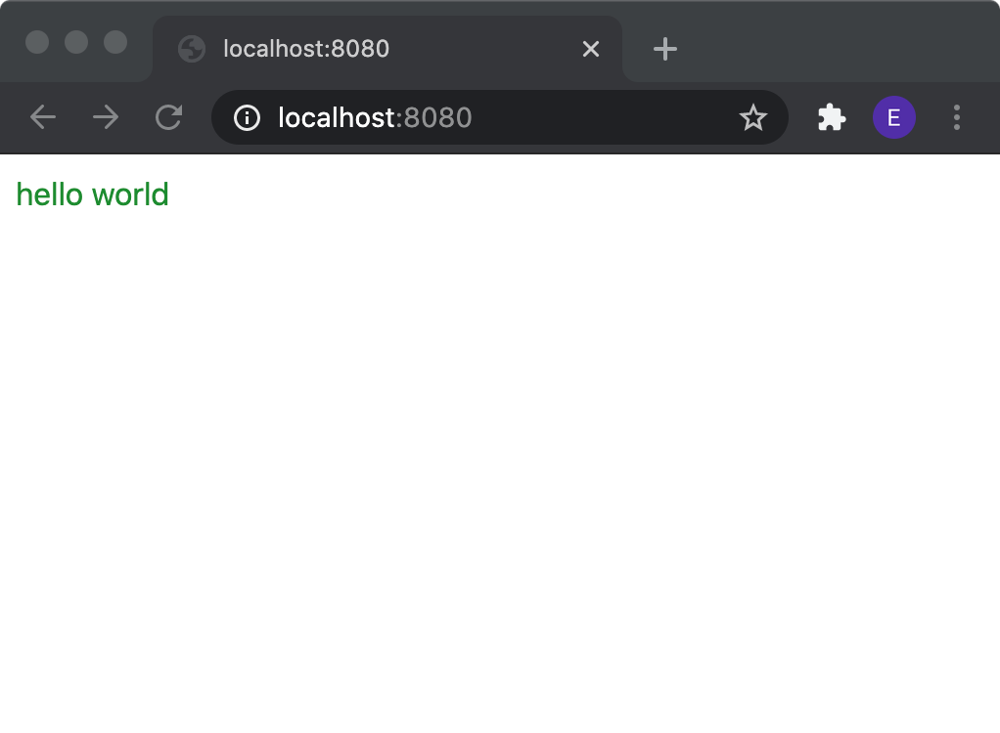

# gotrino-make

Package gotrino-make/cmd/gotrino-make contains a program to build or serve with hot deployment a gotrino wasm project.

## usage and example

```bash
# install into ~/go/bin
GO111MODULE=off GOPROXY=direct go get -u github.com/golangee/gotrino-make/cmd/gotrino-make

# create a new wasm project
mkdir -p ~/tmp/gotrino-test/cmd/wasm
cd ~/tmp/gotrino-test
go mod init mycompany.com/myproject

# by convention, there must be a main package in cmd/wasm as an entry point
cat > cmd/wasm/main.go << EOL
package main

import (
	"github.com/golangee/dom"
	"github.com/golangee/gotrino"
	"github.com/golangee/gotrino-tailwind/button"
)

func main() {
    // start your actual application, better refactor it into a call to internal/app
    run()
    
    // keep wasm alive, e.g. for click listeners
	select {} 
}

func run(){
    // show error, if run fails with panic
    defer dom.GlobalPanicHandler() 
    
    // render some component or html
    gotrino.RenderBody(button.NewTextButton("hello world",func(){
        panic("not yet implemented")
      }))
}
EOL

# make nice
gofmt -w cmd/wasm/main.go

# build for productive deployment
gotrino-make -dir=./dist build

# serve and rebuild automatically. Use 0.0.0.0 to be able to connect with your smartphone (security concern). 
# Now change your file and note that the browser will automatically reload the page.
gotrino-make -host=0.0.0.0 -www=. serve
```

<p align="center">
  
</p>

## gotrino-make options

```bash
gotrino-make -h

Usage gotrino-make:
  -debug
        enable debug logging output for gotrino-make.
  -dir string
        the target output build directory. If empty a temporary folder is picked automatically.
  -extra string
        filename to a local json file, which contains extra BuildInfo values. Accessible in templates by {{.Extra}}
  -forceRefresh
        if set to true, all file hashes are always recalculated for each build instead of relying on ModTime.
  -generate
        if set to true, 'go generate' is invoked everytime before building.
  -host string
        the host to bind on. (default "localhost")
  -port int
        the port to bind to for the serve mode. (default 8080)
  -templatePatterns string
        file extensions which should be processed as text/template with BuildInfo. (default ".gohtml,.gocss,.gojs,.gojson,.goxml")
  -www string
        the directory which contains the go wasm module to build.

```

## BuildInfo fields for templating

```go
// BuildInfo provides some basic information about a gotrino build.
type BuildInfo struct {
    // Time of this build.
    Time time.Time
    // Version contains a hash or something else which uniquely identifies this build.
    Version string
    // CompileError is nil or contains a compile error.
    CompileError error
    // HotReload is true, if the server should be polled at /api/v1/poll/version.
    HotReload bool
    // Wasm is true, if the web assembly (app.wasm) is available.
    Wasm bool
    // Commit may be empty, if the project is not contained in a git repository.
    Commit string
    // Host name.
    Host string
    // Compiler denotes the compiler which has created the wasm build.
    Compiler string
    // Extra may be nil or injected by user.
    Extra interface{}
}
```